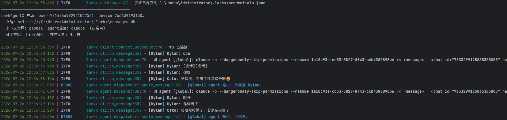
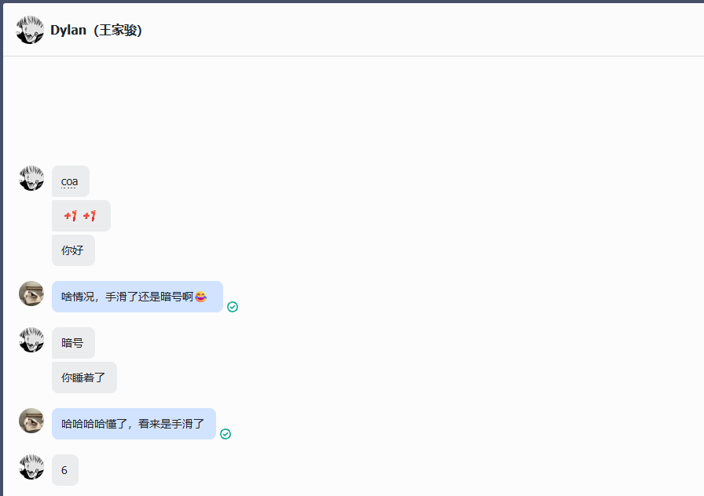

<div align="center">

<p align="center">
  <a href="https://github.com/cv-cat/LarkAgentX" target="_blank">
    
  </a>
</p>

# LarkAgentX

### 你的飞书 AI 助手 🚀

[](https://www.python.org/)

一个基于飞书(Lark)的 AI Agent，通过逆向飞书网页版内部协议，让你的飞书账号直连本地 coding agent。

**无需配置飞书机器人，你的飞书账号即是 AI 助手。**

</div>

## 项目概述 🌟

Lark Agentx 是一个现代化的 Python 应用程序，能够:

- 📊 逆向飞书 Protobuf 格式传输的 WebSocket 和 API，监听并记录消息
- 🔐 扫码登录(网页登录接口),凭证本地持久化，过期可交互重登
- 🤖 把消息按对话边界排队后交给本地 coding agent(Claude Code),它自己决定回复并用 CLI 发出去
- 💾 使用 SQLAlchemy 将消息存储到 SQLite(默认)/MySQL 数据库
- 🧩 全量逆向资产: 25 种消息类型解码、2200+ 网关接口类型名直达调用、8296 个官方 proto 定义

## 效果图🧸

<div align="center">
  
  <br>
  <em>图1: 后台日志——启动横幅、消息收发、agent 调用一目了然</em>
</div>

<div align="center">
  
  <br>
  <em>图2: 数字人在飞书里真实对话(左边是别人,右边蓝框是数字人)</em>
</div>

## ✨ 功能特点

- **扫码登录**: `lark auth qr` 终端出二维码，飞书 App 扫码即登；凭证持久化到 `~/.larkx/credentials.json`，失效时交互菜单重登(扫码/粘贴 cookie)
- **消息监听**: WS 长连接(自动 ACK + 30s 应用层心跳),25 种消息类型全量解码(文本/图片/卡片/富文本/文件/合并转发…)
- **数字人**: 消息按 `chat_id + scope + anchor` 对话边界 FIFO 排队,XML 交给本地 coding agent,它自己决定回不回、回什么,并自己执行 `lark send` 发出
- **任意接口**: `lark api <proto类型名>` 调用全部 2200+ 网关接口(搜索/用户信息/拉历史/已读回执…)
- **历史回填**: `lark history <chat_id> --save` 按 position 拉历史消息并解码入库
- **资源下载**: 图片/文件明文直出,`lark download` 一键下载
- **数据持久化**: SQLite 默认,MySQL 可切;消息/会话/agent 会话三张表
- **已读回执**: 处理过的消息自动标记已读(`LARKX_MARK_READ` 可关)

## 📦 当前支持的命令

| 命令 | 描述 |
|-------|------|
| `lark auth qr` | 扫码登录(推荐) |
| `lark auth import` | 粘贴 cookie 登录 |
| `lark auth check` | 校验凭证是否过期 |
| `lark send <chat_id> <text>` | 发送文本消息(`--root` 回复进话题) |
| `lark listen` | 常驻: WS 收消息入库 |
| `lark listen --agent` | 常驻: 收消息 + 接 coding agent 自动回复 |
| `lark messages <chat_id>` | 读本地消息记录(`--anchor` 只看话题) |
| `lark history <chat_id>` | 拉历史消息(`--save` 入库) |
| `lark download <msg_id>` | 下载消息里的图片/文件 |
| `lark api <类型名> '<json>'` | 调任意网关接口 |
| `lark chats` / `lark sessions` | 会话列表 / agent 会话表 |
| `lark search <关键词>` | 搜索用户/群 |
| `lark config` | 查看生效配置 |

## 📂 项目结构

```
project/
├── larkx/                  # 产品代码
│   ├── cli.py              # lark 命令: auth/send/messages/history/api/download/listen…
│   ├── client.py           # WS 长连接 + /im/gateway/ 网关 + 通用 api() + 拉历史
│   ├── auth.py             # 凭证管理 + 扫码登录(QrLogin)
│   ├── config.py           # 配置(.env + 环境变量)
│   ├── media.py            # 图片/文件等资源下载
│   ├── proto/              # pb2 定义、25 种消息解码、请求构造、通用网关、id 生成
│   ├── storage/            # 消息存储(SQLAlchemy: SQLite 默认,MySQL 可切)
│   └── agent/              # 本地 coding agent 接入(Claude Code;触发规则;命令控制)
├── main.py                 # 产品入口: python main.py = lark listen --agent
├── dev/proto_pipeline/     # 维护者工具: 协议更新后重新提取 proto/cmd 的管线
├── static/resource/        # 图片资源
├── .env.example            # 配置样例
└── requirements.txt        # 项目依赖
```

## 🛠️ 作为库二次开发

```python
import asyncio
from larkx import LarkAuth, LarkClient

client = LarkClient(LarkAuth())                  # 自动读取 ~/.larkx/credentials.json

async def on_message(msg):
    print(msg["chat_id"], msg["from_id"], msg["content"])
    # msg 已按类型解码(文本/图片/卡片/文件…),含 scope/anchor 话题边界

asyncio.run(client.connect_websocket(on_message))  # 自动 ACK + 30s 心跳 + 全类型解码

# 发消息 / 调任意接口
client.send_msg("你好", chat_id="<chat_id>")
client.api("chats.PullChatsByIdsRequest", {"chatIds": ["<chat_id>"]})
```

接口名怎么找: `larkx/proto/cmd_map.json` 内置全部 2202 条映射,`larkx/proto/lark_all_pb2.py` 内置 8296 个类型定义,搜关键词直接用。

## 🔧 环境要求

- Python >= 3.9
- (可选) 本机安装 Claude Code CLI,用于数字人自动回复

## 📦 安装方法

```bash
pip install -e .
# 或: pip install -r requirements.txt && python -m larkx.cli --help
```

安装后 `lark` 命令全局可用。

## 🛠️ 配置说明

复制 `.env.example` 为 `.env`(全部有默认值,按需修改):

```bash
LARKX_HOME=~/.larkx                                    # 数据目录
LARKX_STORAGE_URL=                                     # 留空=SQLite(LARKX_HOME/messages.db);MySQL 填 mysql+pymysql://<user>:<password>@<host>:3306/<db>
LARKX_CONTEXT_SCOPE=anchor                             # agent 上下文边界: anchor(会话+话题) | chat(会话) | global(全部共享)
LARKX_AGENT_BACKEND=claude                             # claude | none
LARKX_SYSTEM_PROMPT=                                   # 数字人系统提示词,留空用内置默认
LARKX_MARK_READ=true                                   # 收到消息自动标已读(清理未读角标),false 关闭
LARKX_TRIGGER_PREFIX=                                  # 只处理以此前缀开头的消息,如 /run;留空=全部处理
```

`lark config` 可查看当前生效配置。登录凭证不放 .env,用 `lark auth qr` / `lark auth import` 管理。

## 🚀 使用指南

```bash
# 1. 登录(二选一)
lark auth qr                                     # 扫码登录(推荐): 终端出二维码,飞书 App 扫一下即可
lark auth import --cookie "<粘贴你的完整 cookie>"  # 或手动: F12 复制任意请求的完整 Cookie 头
lark auth check                                  # 校验凭证是否过期

# 2. 启动(WS 收消息 + 接入本地 AI 自动回复)
python main.py                                   # 等价于 lark listen --agent
# 凭证缺失/失效时会弹出交互菜单(扫码/粘贴 cookie),不用手动处理
```

启动时首行打印生效配置(账号/存储/上下文边界/agent 后端/触发前缀/提示词),配置不对一眼可见。

## 🤖 数字人工作方式

- **触发**: `LARKX_TRIGGER_PREFIX` 过滤,不满足的消息只入库不进队列
- **队列**: 每个对话边界(`context_scope`: 会话+话题/会话/全局)一个独立 FIFO 队列,逐条处理不攒批不丢消息
- **上下文**: 按 `context_scope` 划分独立 session(Claude Code `--session-id/--resume` 持久续聊);每条消息以 XML 交给 agent,自带完整上下文:

```xml
<message>
  <chat id="7627..." name="项目A群" type="GROUP" anchor=""/>
  <sender id="7314..." name="张三"/>
  <at_me>true</at_me>
  <time>2026-07-26 10:00:00</time>
  <content>方案看一下</content>
</message>
```

- **回复**: agent 是完整的 coding agent,它的 stdout 不重要——**它想回复就自己执行 `lark send <chat_id> "<内容>"`**(prompt 里已把当前会话/话题的参数填好,话题消息带 `--root <anchor>`);不想回就直接结束,不是所有话都需要它接
- **回环闭合**: agent 通过 `lark send` 发出的消息经 WS 回显回来,自动入库并标记 `direction=out`(日志里青色区分);自己账号的消息永远不会再进 agent 队列,不会自回环

### 控制命令(写死,优先级低于触发规则)

设了 `LARKX_TRIGGER_PREFIX`(如 `/run`)时,必须 `/run /stop` 才生效,裸 `/stop` 会被过滤忽略:

| 命令 | 行为 |
|---|---|
| `/clear` | 重开当前 session(清排队 + 新 session id),回执确认 |
| `/clear <内容>` | 重开 session 后,把 `<内容>` 作为新会话的第一个问题继续 |
| `/stop` | 清空当前 session 全部排队消息,回执确认 |
| `/stop <内容>` | 清空排队后,把 `<内容>` 作为下一条消息继续(session 不变) |

命令必须在消息**开头**(去触发前缀后);`请 /stop 一下`、`/stoppp` 不识别。正在 agent 处理中的那条无法取消,只能清未处理的。

## 🗄️ 数据库结构

`messages` 表(一行一条消息):

| 列名 | 类型 | 描述 |
|---|---|---|
| `msg_id` | VARCHAR | 飞书消息 id |
| `chat_id` / `chat_name` / `chat_type` | VARCHAR/INT | 会话(1=私聊 2=群 3=话题群) |
| `scope` | VARCHAR | `chat`=主会话流 / `topic`=话题内消息 |
| `anchor` | VARCHAR | 话题 id(threadId);主会话为 `''` |
| `sender_id` / `sender_name` | VARCHAR | 发送者 |
| `msg_type` / `msg_type_name` | INT/VARCHAR | 25 种消息类型(TEXT/IMAGE/CARD/POST/MERGE_FORWARD…) |
| `content` / `content_data` | TEXT | 可读摘要 / 结构化 JSON |
| `direction` | VARCHAR | in(收到) / out(发出) |

`agent_sessions` 表(数字人会话):`session_key`(anchor 模式 `chat_id:anchor`、chat 模式 `chat_id`、global 模式 `global`)、`chat_id`、`anchor`、`agent_session_id`、`started`、`msg_count`、`last_active`。查看: `lark sessions`。

## 🧪 测试

```bash
pip install pytest
python -m pytest tests/    # 33 个离线测试,全自包含(合成帧,不依赖抓包)
```

## 🤝 贡献指南

欢迎贡献！请随时提交 Pull Request。

1. Fork 这个仓库
2. 创建您的特性分支 (`git checkout -b feature/amazing-feature`)
3. 提交您的更改 (`git commit -m '添加一些很棒的特性'`)
4. 推送到分支 (`git push origin feature/amazing-feature`)
5. 打开 Pull Request

## 🐛 问题与支持

如果您遇到任何问题或有疑问，请[提交issue](https://github.com/cv-cat/LarkAgentX/issues)或访问我们的[讨论论坛](https://github.com/cv-cat/LarkAgentX/discussions)。

## Star 趋势

<a href="https://cvcat.site/star-history/svg?repos=cv-cat/LarkAgentX&type=Date">
  <picture>
    <source media="(prefers-color-scheme: dark)" srcset="https://cvcat.site/star-history/svg?repos=cv-cat/LarkAgentX&type=Date&theme=dark" />
    <source media="(prefers-color-scheme: light)" srcset="https://cvcat.site/star-history/svg?repos=cv-cat/LarkAgentX&type=Date" />
    
  </picture>
</a>

## 🍔 交流群

如果你对爬虫和 AI Agent 感兴趣，可以加入群聊一起讨论~

ps: 请加群，人满或者过期 issue | wx 提醒 | qq提醒

| group-1 | group-2 | group-3 | group-4 (2000人qq群) |
|:--:|:--:|:--:|:--:|
|  |  |  |  |
